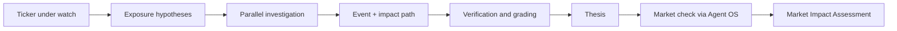
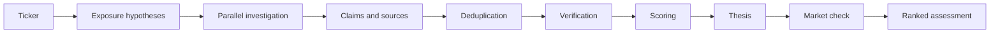

# StockIntel

**Find the event before it becomes the price.**

StockIntel is event-driven equity intelligence. You name a ticker and the network investigates the world behind it the buildouts, filings, capacity guides and contracts that move stocks before price reflects them then checks the market to see whether the thesis is priced in yet.



## The problem it solves

A trader watching NVDA will not find its next move by searching "NVDA". The move starts elsewhere a hyperscaler approves a $10B AI buildout, TSMC guides capacity up, a power supplier wins a data-center contract. By the time that becomes "NVDA is up 3%", the opportunity is gone.

Price charts show what already happened. News search returns what everyone already read. Neither answers the questions that matter before a move:

- what event could materially change this ticker's value
- who is economically exposed: customers, suppliers, infrastructure
- when the impact window opens, and how fresh the signal is
- what evidence proves each link, and what could invalidate it

StockIntel takes a plain-language watch request such as

> Watch NVDA what is happening in the world that could materially change its value?

and investigates everything around the asset instead of the asset itself. It looks for the events that create exposure new builds, capex guides, filings, procurement, footage and turns what it finds into ranked impact assessments with reasoning and verifiable sources. The goal is not more tickers. It is a short set of theses a trader can act on and verify.

## How we built it

StockIntel is an intelligence network, not a screener. One orchestrator directs ten specialists. The system forms hypotheses before anyone searches, investigates in parallel, and synthesizes what comes back into one assessment per exposure.



The flow is:

**Ticker → exposure hypotheses → specialist investigation → event → impact path → thesis → market check → ranked assessment**

## How it thinks

A reasoning objective, not a checklist. Telling an agent "for NVDA, always check hyperscalers, power, TSMC" produces a checklist, not intelligence. The agent gets lazy: check Microsoft, check Google, check TSMC, done. StockIntel instead gives the system an objective and lets the exposure graph emerge from the investigation itself.

- **Don't investigate the ticker. Investigate the world that can move the ticker.** For NVDA, that means reasoning outward: hyperscalers, AI capex, data-center builds, power, networking, semiconductor supply, procurement, customers, suppliers, events, then back to NVDA exposure and market pricing.
- **Never restrict investigation to predefined entities.** The graph expands wherever evidence creates a meaningful connection. A Xiaomi watch might lead to an EV battery supplier, a lithium contract, an Indian manufacturing partner, or import regulation. Nobody wrote those paths down beforehand.
- **Prioritize like an analyst:** economic materiality, causal proximity, magnitude, probability, timing, novelty, evidence quality.
- **Answer seven questions per thesis:** what happened, why it matters economically, through what relationship it reaches the asset, what direction it could push value, how large the effect could be, whether the market already incorporated it, and what would invalidate the thesis.
- **The chain is the intelligence, not a score.** Every conclusion reads as event, exposure, link, economic effect, materiality, novelty, market test, conclusion. A bare confidence number without that chain is theater.
- **"Already priced" is a first-class answer.** If the event is real but the market incorporated it, the system says so: interesting event, no actionable edge. The relationship between the event and current pricing is the actual product.

### Exposure hypotheses

Before any specialist searches, the orchestrator maps what could move the ticker: who buys from it, who supplies it, what infrastructure it rides on, where such events get reported. The system searches the circumstances that create exposure rather than the ticker itself.

### Specialist agents

Each specialist is bounded to a type of intelligence. Together they cover different surfaces of the market:

- **Web Research** - general web and news investigation
- **Social Signal** - public statements that indicate material developments
- **Project Intel** - construction, infrastructure and development projects
- **Company Intel** - organizations and their activities
- **Person/Role Intel** - public professional roles and relationships
- **Procurement** - tenders, contracts and purchasing activity
- **Media / YouTube** - interviews, tours and audiovisual sources, with transcript extraction
- **Verification** - independent verification of important claims
- **Synthesis** - connecting evidence into coherent theses
- **Prime Signals** - first-party connector covering Google News RSS, GDELT and SEC EDGAR filings

The orchestrator assigns work. Specialists return structured claims. The orchestrator decides what becomes an assessment, what needs verification, and what triggers further investigation.

### The exposure graph

One event fans into many exposures:

```
Hyperscale AI buildout
        │
        ├── GPUs → NVIDIA
        ├── Memory → Micron
        ├── Servers → Dell
        ├── Networking → Broadcom
        └── Power → infrastructure names
```

The graph holds Company → Customers → Suppliers → Partners → Projects → Industries → Related assets. An event three levels away from the watched ticker can still surface as a ranked assessment without anyone ever searching the ticker directly.

### Direct and indirect signals

A **direct** signal: NVIDIA announces a major customer. An **indirect** signal: Microsoft announces a massive AI data-center expansion Microsoft → infrastructure → GPU demand → NVIDIA → TSMC. Every assessment carries its impact path, with evidence supporting each edge.

### Evidence

Every meaningful claim carries evidence and a source. The system keeps a clear boundary between what a source confirms and what the system infers from it. A source date, URL and observed item support each claim, and the readout shows both the fact and the inference so the reader can follow the reasoning.

### Duplicate evidence

Five specialists citing the same article count as one source, not five independent confirmations. Source clustering canonicalizes URLs and groups citations of the same underlying document into a single cluster. Independent sources increase confidence. Repeated citations do not.

### Recursive investigation

A discovery can trigger controlled follow-up investigation. Finding a data-center expansion, for example, can lead to an investigation of the contractors, the equipment suppliers, or the power arrangements. Recursion is bounded by depth, source count and token budget, and terminates on diminishing returns or duplicate detection.

### Thesis first, price second

The sequence is strict:

**World → Event → Economic impact → Exposure → Thesis → Market price**

Never the reverse. The thesis is formed off-market and independently then contextualized against the market. Otherwise you build a momentum bot wearing an intelligence costume.

### The market check (Binance Agent OS)

Only after the thesis exists, StockIntel queries live market context through the Binance Agent OS MCP server: current price, recent movement, volume, and the user's watched position inside a permissioned sub-account. Read-only. No withdrawals, ever. The agent proposes; the trader decides.

A positioning gauge (`src/lib/binance/market-test.ts`) measures where price already sits: range position, 14-session run, daily wobble. It emits measurements, never verdicts. It is built to grow: reverse-DCF and peer-relative checks slot in as functions beside it once fundamentals arrive.

Typical readout line:

> NVDA up 2% despite a fresh hyperscale expansion announcement; the information may not be fully reflected in the observed price. Related exposure: MU, DELL, AVGO.

### The output: Market Impact Assessment

Not buy/sell. Each assessment carries impact, magnitude, confidence, event freshness, observed price reaction, related exposures, the reasoning, and what could invalidate it. An analytical assessment, not a prediction.

A note on voice: the live application speaks only in outcomes. Theses, evidence, confidence. The machinery behind them, ten specialists, orchestration, clustering, grading, lives here in this document and in `soul.md`, where it belongs. A trader should never need to know what an agent is.

## Technologies we used

Application and infrastructure:

- SvelteKit
- TypeScript
- Vite
- Bun
- Vercel
- Turso libSQL
- Drizzle ORM
- Tailwind
- Radix
- TanStack Router

Intelligence:

- Google News RSS
- GDELT
- SEC EDGAR
- YouTube Data API
- YouTube timedtext transcripts
- Custom scoring and clustering
- Evidence graph
- Exposure hypothesis generation
- Recursive investigation
- `soul.md` synthesis

Market layer:

- Binance Agent OS MCP read-only market context (prices, volume, positions)
- 0G Compute LLM grading of claim relevance and evidence quality
- Base settlement and USDC payouts to contributing specialists
- ERC-7857 Agentic ID identity for participating specialists
- Virtuals ACP v2 selling assessment readouts agent-to-agent
- Sibyl memory intelligence that compounds across inquiries instead of restarting at zero

## Sibyl memory layer

StockIntel's intelligence compounds across watches instead of restarting at zero on every inquiry. A persistent memory substrate organized as six stores source registry, claim store, reliability ledger, exposure graph nodes, inquiry store, follow-up queue means the second watch on a ticker is better than the first: warm briefs, targeted re-checks, and claims that re-verify themselves without anyone asking.

## Challenges we ran into

### Reliable intelligence from multiple specialists

A distributed network can generate more data without generating better intelligence. Specialization, structured claims, orchestration and verification keep it honest: one surface per specialist, one common claim shape, and the orchestrator decides what advances.

### Duplicate sources

Multiple specialists independently finding the same article inflates confidence if unhandled. Source clustering canonicalizes and groups citations of the same document so confidence grows only with genuinely independent corroboration.

### Thesis discipline

It is tempting to let price action write the narrative. The pipeline enforces the order instead: world first, market last. Anything that cannot show an exposure path from event to ticker does not become an assessment.

### Depth vs speed

Ten specialists need time to investigate independently, but the product must stay practical. Parallel research and bounded recursion keep depth without open-ended cost.

## What we learned

### Events beat tickers

Starting from the situations that move stocks produces stronger intelligence than screening the stocks themselves. Framing around events finds exposure that keyword matching misses.

### Independent evidence matters more than volume

Repeated citations are not corroboration. Confidence should increase with genuinely independent sources, not with the number of times one source is reported.

### Exposure context matters

A signal becomes tradable when combined with the impact path, the freshness, the observed market reaction and the invalidation conditions. Context turns a mention into a thesis.

### Facts and inference must remain separate

Show what a source confirms and what the system concludes as two distinct things. That boundary makes the output verifiable and the reasoning inspectable.

### Intelligence compounds

Entities, relationships, events and evidence accumulate into a picture of forming exposure rather than isolated answers. The evidence graph makes that accumulation useful over time.

## Status

StockIntel runs end to end today:

- Natural language watch requests with exposure hypothesis generation
- Ten first-party specialists investigating in parallel
- Structured claims with evidence and sources
- Source clustering and deduplication
- Deterministic grading and LLM grading through 0G Compute
- Bounded recursive follow-up investigation
- Evidence and exposure graphs
- Synthesis into one assessment per exposure guided by `soul.md`
- Read-only market context via Binance Agent OS MCP, persisted per inquiry
- Positioning gauge feeding the market test; verdicts stay with the thesis
- Outcome reflection (`bun scripts/reflect-outcomes.ts`): past verdicts judged against later price action, lessons written back to Sibyl memory
- Base settlement, USDC payouts and ERC-7857 identities
- Sibyl memory across inquiries

Built for Track A of the Binance Agent OS Mini Hackathon.

## Built by Prime Isles

Prime Isles is an independent engineering team focused on AI, autonomous agents, Web3, developer infrastructure, and building systems that turn complex information into useful action.
